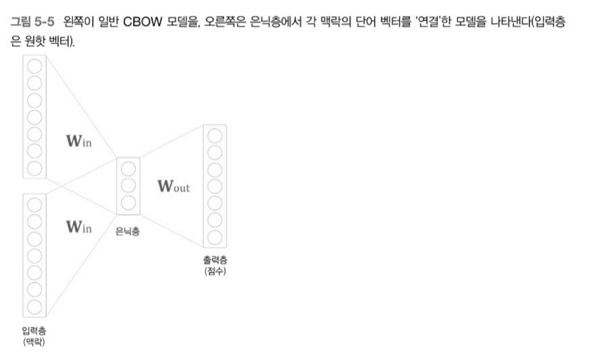
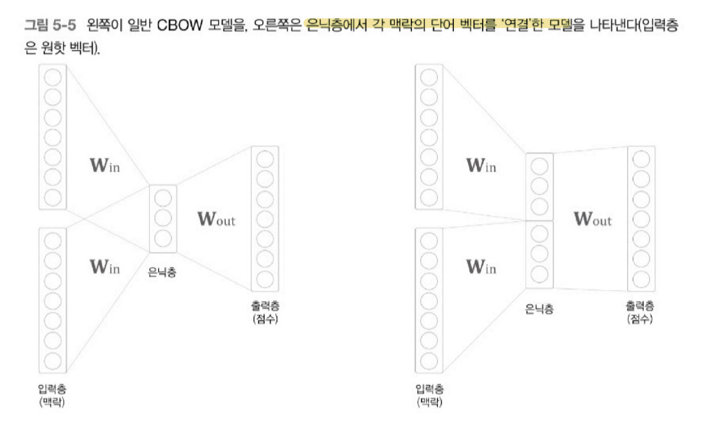
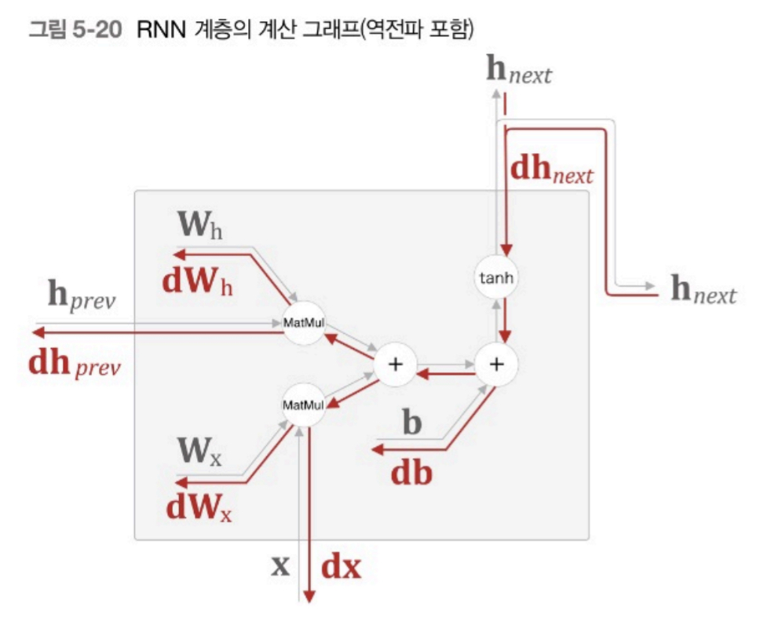
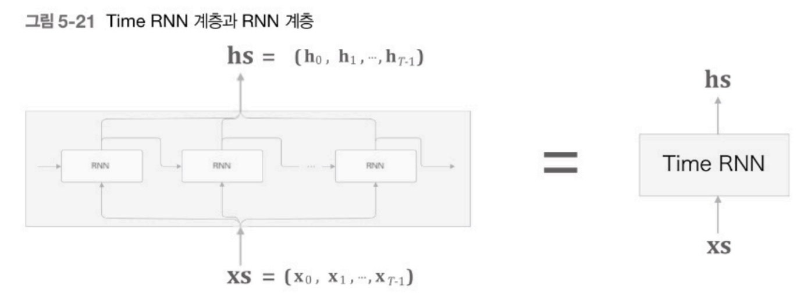
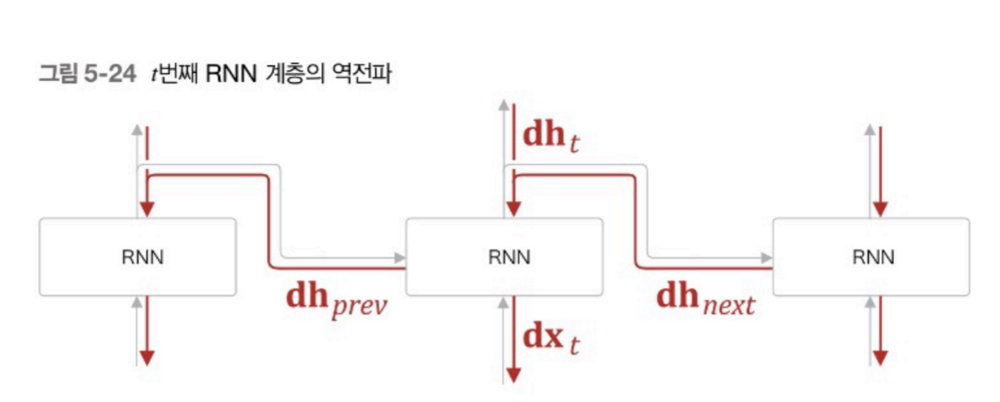
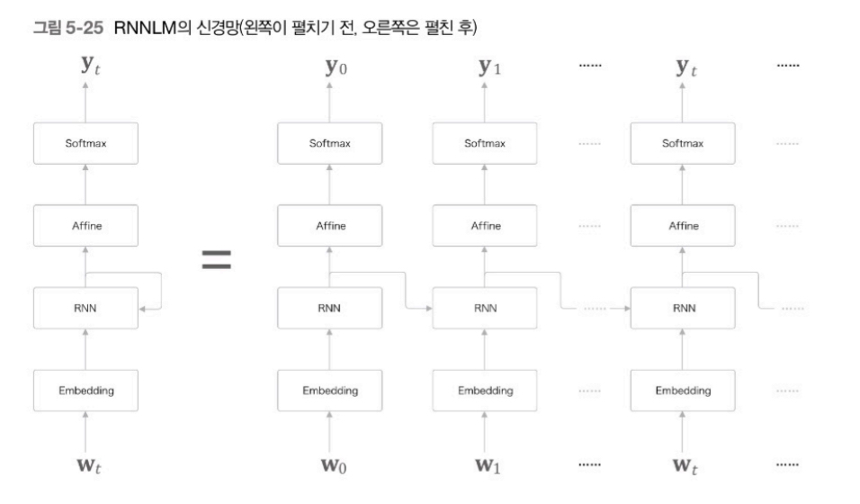
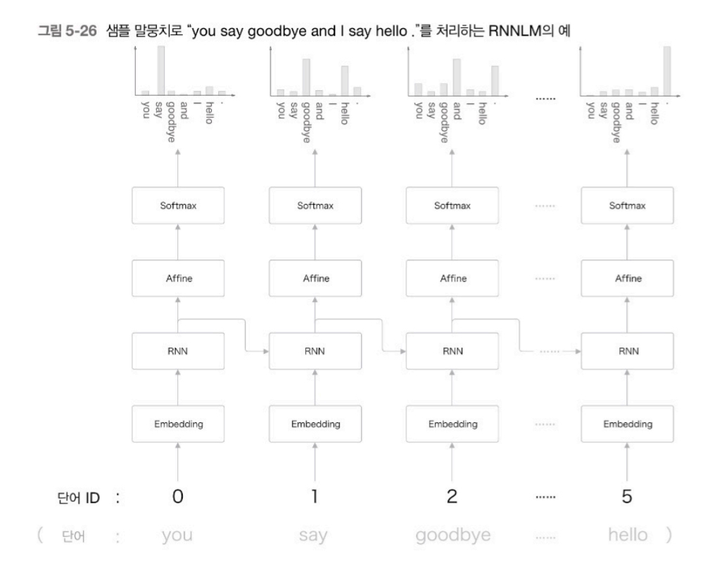

# TL;DR

- RNN은 Langauge Model에 적용할 수 있는 신경망 중 하나의 Architecture 이다.

- RNN은 Langauge Model에 적용할 수 있는 신경망 중 하나의 Architecture 이다.
- RNN은 순환하는 경로가 있고, 이를 통해 내부에 ‘은닉 상태’를 기억할 수 있다.
- RNN은 순환 경로를 펼치면 다수의 RNN 계층이 연결된 신경망으로 해석할 수 있으며, 오차역전파법으로 학습할 수 있다. (=BPTT)

<br /><br /><br />

# RNN (Recurrent Nueral Network)

지금까지 살펴본 신경망은 흐름이 단방향인 Feed Forwad 유형의 신경망이다. 입력 신호가 은닉층으로 전달되고, 다시 출력층까지 한 방향으로만 신호가 전달된다. 피드포워드 신경망의 단점은 시계열 데이터의 패턴을 충분히 학습하지 못한다는 것이다.

> 👆 **시계열 데이터란?** 
> 일정한 시간 동안 수집 된 일련의 순차적으로 정해진 데이터. 시간 순서가 있고, 연속한 관측치가 서로 상관 관계를 갖는다. 
> ex) 일일 코스피 주식 가격, 기온 등 날씨 관련 측정치, GDP, 음성 데이터, …

<br />

## 5.1 확률과 언어 모델

**언어 모델 Language Model**은 단어 나열에 확률을 부여해, 특정 단어의 시퀀스에 대해 그 시퀀스가 일어날 가능성(얼마나 자연스러운 단어 순서인지)을 확률로 평가한다. 즉 가장 자연스러운 단어의 나열을 찾아내는 모델이다.

- 예를 들어 “you say goodbye” 라는 단어 시퀀스는 높은 확률을 출력하고,
- “you say good die”는 낮은 확률을 출력하게 된다.

보편적으로 사용되는 방법은 ‘이전 단어들이 주어졌을 때 다음 단어를 예측’ 하도록 하는 것이다.

<br />

### CBOW 모델을 언어 모델로 근사하기

word2vec의 CBOW 모델을 보면 주변 단어로 타깃 단어를 추측한다. 만약 왼쪽 단어들로만 타깃 단어를 추측한다면, 이는 “이전 단어들 다음에 올 단어”를 추측하는 것이 된다.


<br />

#### 🔺 context 한계

이전의 모든 단어를 참고하기 어렵기 때문에 맥락의 크기를 특정 값(t=5, 10, ..)으로 한정해 근사적으로 나타낼 수 있다. 하지만 반대로 이렇게 맥락을 고정하면 긴 맥락이 필요한 경우 문제가 된다.


예시의 경우 “Tom”을 기억해야 하는데, 무려 18번째 앞 단어다.

→ 맥락을 20개, 30개, … 어디까지 확장해야 할까?

<br />

#### 🔺 순서가 무시됨



CBOW 모델은 은닉층에서 단어 벡터들이 더해지기 때문에 맥락의 단어 순서는 무시된다. 즉, (Mary, said) 와 (said, Mary)라는 맥락을 똑같이 취급한다.

<br />



맥락의 단어 순서도 고려하기 위해 각 단어를 순서대로 은닉층에 연결(concatenate)할 수 있다. 실제로 신경 확률론적 언어 모델에서는 이런 모델을 선택했다. 다만 이렇게 되면 가중치 매개변수도 늘어나면서 필요 메모리 양과 계산량도 많아지게 된다.

<br /><br /><br />

## 5.2 순환 신경망 RNN 이란?

Recurrent Neural Network, RNN은 순차적인 정보를 처리하는 네트워크다.

- 데이터를 순차적으로 처리하기 때문에 언어에서 고유한 순차적인 성격을 포착할 수 있는 능력이 있다.
- **순환 Recurrent**의 의미는 어느 한 지점에서 시작한 것이 시간을 지나 다시 원래 장소로 돌아오는 것, 그리고 이 과정을 반복하는 것을 의미한다. 순환하기 위해서는 순환하는 경로(닫힌 경로)가 필요하고 이것이 RNN의 특징 중 하나이다.
- 데이터가 순환되기 때문에 과거의 정보를 기억하는 동시에 최신 데이터로 갱신될 수 있다.


각 시각의 RNN 계층은 해당 시각의 입력과 이전 RNN 계층의 출력을 받아 현 시각의 출력을 계산한다. 즉, 현재의 출력 $h_t$는 한 시각 이전의 출력 $h_{t-1}$ 에 기초해 계산된다.


- $W_x$ : 입력 x를 출력 h로 변환하기 위한 가중치
- $W_h$ : 이전 RNN 출력을 다음 시각 출력으로 변환하기 위한 가중치

RNN 계층은 피드포워드 신경망과 같은 구조를 가지지만 다수의 RNN 계층이 모두 실제로 ‘같은 계층’이다. 다만 각 시각의 RNN 계층이 서로 다른 상태 h를 갖는다고 볼 수 있다. **따라서 RNN을 ‘상태를 가지는 계층’ 혹은 ‘메모리가 있는 계층’이라고 부른다.**

<br />

### Backpropagation Through Time, BPTT


RNN 계층은 가로로 펼친 신경망으로 간주할 수 있기 때문에 학습할 때도 보통의 신경망과 같은 순서로 진행할 수 있다.

- 매 시각 RNN 계층의 중간 데이터를 기억해야 하므로 시계열 데이터가 길어질 수록 BPTT가 메모리 사용량과 계산량이 증가한다.
- 데이터 길이가 길어지면 한 계층을 통과할 때마다 기울기 값이 작아지므로 Gradient Vanishing 문제가 발생할 수 있다.

<br />

### Truncated BPTT

위 문제를 해결하기 위해 역전파 시 신경망 연결을 적당한 길이로 ‘끊어서’ 각각 블록 단위에 독립적으로 오차역전파법을 적용한다.

<br /><br /><br />

## 5.3 RNN 계층 구현

### 1) 순전파


```python
class RNN :
	def __init__(self, Wx, Wh, b) :
		self.params = [Wx, Wh, b]
		self.grads = [np.zeros_like(Wx), np.zeros_like(Wh), np.zeros_like(b)]
		self.cache = None    # 역전파 시 사용할 중간 데이터

	def forward(self, x, h_prev) :
		 Wx, Wh, b = self.params
			t = np.matmul(h_prev, Wh) + np.matmul(x, Wx) + b
			h_next = np.tanh(t)
			
			self.cache = (x, h_prev, h_next)
			return h_next
```

<br />

### 2) 역전파



```python
	def backward(self, dh_next) :
		Wx, Wh, b = self.params
		x, h_prev, h_next = self.cache
		
		dt = dh_next * (1 - h_next ** 2)
		db = np.sum(dt, axis=0)        # 편향 -> 0번 축의 합
		dWh = np.matmul(h_prev.T, dt)  # 곱셈노드는 신호 서로 바꿈
		dh_prev = np.matmul(dt, Wh.T)
		dWx = np.matmul(x.T, dt)
		dx = np.matmul(dt, Wx.T)

		self.grads[0][...] = dWx
		self.grads[1][...] = dWh
		self.grads[2][...] = db

		return dx, dh_prev
```

<br />

### 3) TimeRNN

TimeRNN 계층은 RNN 계층 T개를 연결한 신경망이다.



```python
class timeRNN :
	def __init__(self, Wx, Wh, b, stateful=False) :
		self.params = [Wx, Wh, b]
		self.grads = [np.zeros_like(Wx), np.zeros_like(Wh), np.zeros_like(b)]
		self.layers = None    # 다수의 RNN 계층 리스트

		self.h, self.dh = None, None
		self.stateful = stateful

	def set_state(self, h) :
		self.h = h

	def reset_state(self) :
		self.h = None

	def forward(self, xs) :    # xs : T개의 시계열 데이터
		Wx, Wh, b = self.params
		N, T, D = xs.shape       # 미니배치 크기, 시계열 데이터 길이, 입력 벡터 차원 수
		D, H = Wx.shape

		self.layers = []
		hs = np.empty((N, T, H), dtype='f')
		
		if not self.stateful or self.h is None :
			self.h = np.zeros((N, H), dtype='f')
		
		for t in range(T):       # 시계열 데이터를 순서대로 RNN 계층에 넣기  
			layer = RNN(*self.params)
			self.h = layer.forward(xs[:, t, :], self.h)
			hs[:, t, :] = self.h
			self.layers.append(layer)

		return hs
```

<br />



그리고 t번째의 RNN 계층을 보면 순전파 시에 출력이 2개로 분기되므로 역전파 때는 각 기울기가 합산되어야 한다.

<br />

```python
def backward(self, dhs) :
		Wx, Wh, b = self.params
		N, T, H = dhs.shape      
		D, H = Wx.shape

		dxs = np.empth((N, T, D), dtype='f')
		dh = 0
		grads = [0, 0, 0]

		for t in reversed(range(T)):
			layer = self.layers[t]
			dx, dh = layer.backward(dhs[:, t, :] + dh) # 합산된 기울기
			dxs[:, t, :] = dx

			for i, grad in enumerate(layer.grads):
				grads[i] += grad

		for i, grad in enumerate(grads):
			self.grads[i][...] = grad
		self.dh = dh

		return dxs
```

<br /><br /><br />

## 5.4 시계열 데이터 처리 계층 구현 (언어 모델 구현)

RNN을 사용해 ‘언어 모델’을 구현해보자. 편의상 RNN Language Model, RNNLM 이라고 부르자.



- 첫 번째 층은 Embedding 계층 : 단어 ID를 단어의 분산 표현(단어 벡터)으로 변환
- RNN 계층 : 단어의 분산 표현이 입력되어 은닉 상태를 다음 계층으로 출력함과 동시에, 다음 시각의 RNN 계층으로 출력한다.
- Affine 계층 + softmax : RNN 계층의 출력을 받은 후 각 단어별 다음 시각에 위치할 확률을 계산한다.

<br />



<br />

### Time 계층의 구현

- 시계열 데이터를 한 번에 처리하는 계층을 TimeRNN 이라고 부른 것처럼 Time Embedding, Time Affine, Time Softmax with Loss 계층을 만들어 각 시각의 데이터들을 한 번에 처리한다.

- [[code] 확인하기](https://github.com/ExcelsiorCJH/DLFromScratch2/blob/master/Chap05-Recurrent_Neural_Network/simple_rnnlm.py)

<br /><br /><br />

## 5.5 RNNLM 학습과 평가

### 1) RNNLM의 학습

- [[code 확인하기]](https://github.com/ExcelsiorCJH/DLFromScratch2/blob/master/Chap05-Recurrent_Neural_Network/train_custom_loop.py)

<br />

### 2) 언어 모델 평가

언어 모델의 예측 성능을 평가하는 척도로 **Perplexity**를 자주 이용한다. Perplexity는 ‘확률의 역수’라고 볼 수 있고, 작을 수록 좋은 모델이다.


위와 같은 두 개의 모델이 있을 때, 모델 1의 perplexity는 1/0.8 = 1.25 가 되고, 모델 2의 perplexity는 1/0.2 = 5 가 된다. 직관적으로 해석하면 모델 1은 다음에 취할 단어의 후보 수가 1개 정도로 좁혀진 것이고 모델 2는 5개로 좁혀진 것이라고 볼 수 있다.


데이터가 많을 때는 각 데이터의 분기 수를 평균한 것이라고 해석할 수 있다.

